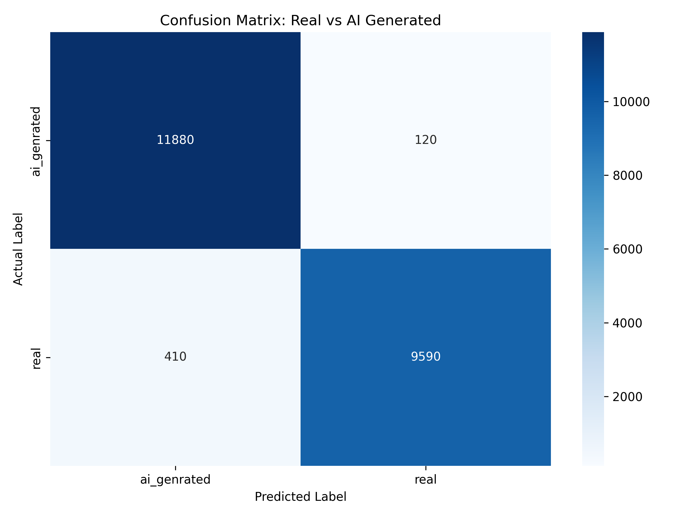

<p align="center">
  
  
  
  
  
</p>

# 🛡️ DeepGuard

**Explainable AI for Image Authenticity Detection**

[](https://render.com/deploy?repo=https://github.com/Frenzy-codes/Deepguard)

DeepGuard is an academic-grade full-stack system that detects whether an uploaded image is **Real** or **AI-Generated**, and visually explains its decision using **Grad-CAM heatmaps**. It combines a ResNet50-based deep learning model, a FastAPI backend, and a React + Vite frontend into a seamless end-to-end pipeline.

---

## 📐 Architecture

```
User Uploads Image
       ↓
  React Frontend  (Vite + Tailwind CSS, port 5173)
       ↓ POST /predict  (proxied to backend)
  FastAPI Backend  (Python, port 8000)
       ↓
 ResNet50 CNN — Binary Classification (Real vs AI-Generated)
       ↓
 Grad-CAM Heatmap Generation (Explainability)
       ↓
 JSON Response  { label, confidence, reliability, heatmap }
       ↓
 Frontend Displays Results + Heatmap Overlay
```

---

## 📂 Project Structure

```
DeepGuard/
├── backend/
│   ├── app/
│   │   ├── __init__.py
│   │   ├── main.py                  # FastAPI app, CORS, route registration
│   │   ├── routes/
│   │   │   └── predict.py           # POST /predict endpoint
│   │   ├── services/
│   │   │   ├── model_service.py     # ResNet50 model loading & inference
│   │   │   └── gradcam.py           # Grad-CAM heatmap generation
│   │   └── utils/
│   │       └── image_utils.py       # Validation, preprocessing, base64 encoding
│   ├── requirements.txt
│   ├── test_model.py                # Unit test: model loading & prediction
│   ├── test_gradcam.py              # Unit test: Grad-CAM pipeline
│   └── test_predict.py              # Unit test: /predict endpoint
├── frontend/
│   ├── src/
│   │   ├── components/
│   │   │   ├── Navbar.jsx
│   │   │   ├── HeroSection.jsx
│   │   │   ├── UploadSection.jsx
│   │   │   ├── ResultsSection.jsx
│   │   │   ├── FeaturesSection.jsx
│   │   │   └── Footer.jsx
│   │   ├── services/
│   │   │   └── api.js               # Axios API layer
│   │   ├── App.jsx
│   │   ├── main.jsx
│   │   └── index.css
│   ├── index.html
│   ├── package.json
│   ├── vite.config.js               # Dev proxy: /predict & /health → :8000
│   ├── tailwind.config.js
│   ├── postcss.config.js
│   ├── vercel.json
│   └── .env.example
├── model/
│   └── deepguard_model.h5           # Trained ResNet50 model (~211 MB)
├── training/
│   └── train_model.py               # Full training script with CLI args
├── dataset/
│   ├── real/                        # Real photographs (JPG/PNG)
│   └── ai_generated/                # AI-generated images (JPG/PNG)
├── render.yaml                      # Render Blueprint for backend deployment
├── run.md                           # Manual run instructions
├── .gitignore
└── README.md
```

---

## 🚀 Quick Start

### Prerequisites

| Tool       | Version  |
| ---------- | -------- |
| Python     | ≥ 3.10   |
| Node.js    | ≥ 18     |
| npm        | ≥ 9      |
| pip / venv | latest   |

---

### 1. Clone the Repository

```bash
git clone https://github.com/your-username/DeepGuard.git
cd DeepGuard
```

---

### 2. Backend Setup

```bash
cd backend

# Create virtual environment
python -m venv venv

# Activate — Windows
venv\Scripts\activate
# Activate — macOS / Linux
# source venv/bin/activate

# Install dependencies
pip install -r requirements.txt

# Start the server
python -m uvicorn app.main:app --reload --port 8000
uvicorn app.main:app --reload --port 8000
```

The API will be available at **http://localhost:8000**.  
Swagger docs: `http://localhost:8000/docs`  
Health check: `GET http://localhost:8000/health`

> **Note:** The backend runs on CPU by default (`CUDA_VISIBLE_DEVICES=-1`). To enable GPU acceleration, remove or modify that line in `app/main.py`.

---

### 3. Frontend Setup

```bash
cd frontend

# Install dependencies
npm install

# Start dev server
npm run dev
```

The app will be available at **http://localhost:5173**.  
The Vite dev server automatically proxies `/predict` and `/health` to the backend at `http://localhost:8000`.

---

## 📊 Dataset Preparation

Organise your dataset in two sub-folders:

```
dataset/
├── real/            ← Real photographs (JPG/PNG)
└── ai_generated/    ← AI-generated images (JPG/PNG)
```

**Recommended sources:**

| Dataset                  | Description                              |
| ------------------------ | ---------------------------------------- |
| CIFAKE                   | 60K real + 60K AI images (CIFAR-based)  |
| ArtiFact                 | Multi-generator AI image dataset         |
| Stable Diffusion outputs | Generate with SD / DALL-E / Midjourney   |
| Unsplash / Pexels        | High-quality real photographs            |

> **Tip:** Aim for at least 1,000 images per class. More data = better accuracy.

---

## 🏋️ Model Training

The training script uses **ResNet50 transfer learning** with data augmentation, early stopping, and learning rate scheduling.

```bash
cd training

# Basic training (uses ../dataset and saves to ../model/deepguard_model.h5)
python train_model.py

# With custom options
python train_model.py \
  --dataset ../dataset \
  --output ../model/deepguard_model.h5 \
  --epochs 20 \
  --batch 64 \
  --lr 0.0001 \
  --fine_tune_at 140
```

The best model checkpoint (by `val_accuracy`) is automatically saved.

### Training Arguments

| Argument         | Default                        | Description                              |
| ---------------- | ------------------------------ | ---------------------------------------- |
| `--dataset`      | `../dataset`                   | Path to dataset directory                |
| `--output`       | `../model/deepguard_model.h5`  | Output model path                        |
| `--epochs`       | `15`                           | Number of training epochs                |
| `--batch`        | `32`                           | Batch size                               |
| `--img_size`     | `224`                          | Input image size (square, px)            |
| `--lr`           | `1e-4`                         | Learning rate (Adam optimizer)           |
| `--fine_tune_at` | `140`                          | Unfreeze ResNet50 layers from this index |

### Training Callbacks

| Callback            | Monitors      | Behaviour                               |
| ------------------- | ------------- | --------------------------------------- |
| `EarlyStopping`     | `val_loss`    | Stops after 5 epochs with no improvement, restores best weights |
| `ModelCheckpoint`   | `val_accuracy`| Saves the best model only               |
| `ReduceLROnPlateau` | `val_loss`    | Halves LR after 3 stagnant epochs       |

---

## 📈 Model Performance Evaluation

The model was evaluated on the validation split using `backend/evaluate.py`.

### Validation Summary

| Metric | Value |
| ------ | ----- |
| Validation samples | 22,000 |
| Correct predictions | 21,470 |
| Misclassifications | 530 |
| Accuracy | 97.59% |

### Class-wise Performance

| Class | Precision | Recall | F1-score |
| ----- | --------- | ------ | -------- |
| ai_generated | 96.66% | 99.00% | 97.82% |
| real | 98.76% | 95.90% | 97.31% |

### Confusion Matrix (Validation)

Rows are actual labels and columns are predicted labels.

| Actual \ Predicted | ai_generated | real |
| ------------------ | ------------ | ---- |
| ai_generated | 11,880 | 120 |
| real | 410 | 9,590 |



---

## 🔌 API Reference

### Health Check

```
GET /health
```

```json
{ "status": "running" }
```

---

### Predict

```
POST /predict
Content-Type: multipart/form-data
```

**Request:**  
Form field `file` — a JPG or PNG image (≤ 10 MB).

**Response:**

```json
{
  "label": "AI-Generated",
  "confidence": 0.93,
  "reliability": "High",
  "heatmap": "<base64_encoded_png>"
}
```

| Field         | Type    | Description                                   |
| ------------- | ------- | --------------------------------------------- |
| `label`       | string  | `"Real"` or `"AI-Generated"`                  |
| `confidence`  | float   | Model confidence score (0.0 – 1.0)            |
| `reliability` | string  | Qualitative reliability (`"High"`, `"Medium"`, `"Low"`) |
| `heatmap`     | string  | Base64-encoded PNG of the Grad-CAM overlay    |

**Error responses:**

| Status | Cause                          |
| ------ | ------------------------------ |
| `400`  | Invalid file type or file too large |
| `500`  | Internal server error          |

---

### Testing with curl

```bash
curl -X POST http://localhost:8000/predict \
  -F "file=@test_image.jpg"
```

---

## 🧪 Backend Tests

Three test scripts are included in the `backend/` directory:

```bash
cd backend

# Test model loading and prediction
python test_model.py

# Test Grad-CAM heatmap generation
python test_gradcam.py

# Test the /predict API endpoint
python test_predict.py
```

---

## ☁️ Deployment

### Frontend → Vercel

1. Push the repo to GitHub.
2. Go to [vercel.com](https://vercel.com) → **New Project** → Import your repo.
3. Set **Root Directory** to `frontend`.
4. Set **Build Command** to `npm run build` and **Output Directory** to `dist`.
5. Add environment variable:
   ```
   VITE_API_URL=https://your-backend.onrender.com
   ```
6. Deploy.

---

### Backend → Render

1. Go to [render.com](https://render.com) → **New Web Service**.
2. Connect your GitHub repo.
3. Set **Root Directory** to `backend`.
4. Set **Build Command** to `pip install -r requirements.txt`.
5. Set **Start Command** to `uvicorn app.main:app --host 0.0.0.0 --port $PORT`.
6. Set **Runtime** to `Python 3.11`.
7. Add environment variable `PYTHON_VERSION = 3.11.7`.
8. Upload `deepguard_model.h5` to the `model/` directory (or use Render Disk).
9. Deploy.

> **Tip:** The included `render.yaml` supports [Render Blueprints](https://render.com/docs/infrastructure-as-code) for one-click backend deployment.

---

## 🧰 Tech Stack

| Layer            | Technology                                  |
| ---------------- | ------------------------------------------- |
| Frontend         | React 18, Vite 6, Tailwind CSS 3            |
| HTTP Client      | Axios 1.7                                   |
| Icons            | Lucide React                                |
| Backend          | Python 3.11, FastAPI 0.115, Uvicorn 0.34    |
| AI Framework     | TensorFlow 2.10 / Keras 2.10                |
| Model            | ResNet50 (ImageNet pre-trained, fine-tuned) |
| Explainability   | Grad-CAM                                    |
| Image Processing | OpenCV 4.8 (headless), Pillow 9.5, NumPy 1.23 |
| Deployment       | Vercel (frontend), Render (backend)         |

---

## 📜 License

This project is released for **academic and educational purposes**.  
It is not intended for production forensic or legal use.

---

<p align="center">
  Built with ❤️ By Team DeepGuard for Explainable AI research
</p>
